# lc-slacker
Comprehensive example showing how to use Slack to trigger a workflow within LimaCharlie. 

## Overview
A custom Slack app with a  is deployed that provides bi-directional communication between LimaCharlie and Slack. A custom 


```mermaid
sequenceDiagram
    autonumber
    Slack->>Slack App: Specified slash command is run in Slack workspace
    Note over Slack,Slack App: Workspace dependent & requires Slack admin
    Slack App->>Sensor: POST request sent to webhook sensor
    Note over Slack App,Sensor: Text adapter using Webhook and custom parser
    Sensor->>Rule: Detects `create-org` event from sensor
    Note over Sensor,Rule: Rule Name: "Detect Slack Slash Command - v2" 
    Rule->>Playbook: Rule executes playbook with specified data
    Note over Rule,Playbook: Playbook Name: "Create Slack Channel"
    Playbook->>Slack: Creates a new channel in slack
    Playbook->>Slack: Invites users specified in `create-org` command invocation
    Playbook->>Sensor: Adds `slack_event` key to playbook returned data with the outcome
    Note over Playbook,Sensor: Sensor is `ext-playbook`
    Playbook->>Rule: Detects `event/slack_event/slack_channel_created` from ext-playbook
    Note over Playbook,Rule: Rule Name: "Detect Slack Channel Created"
    Rule->>Playbook: Executes playbook to build org when requested channel is created
    Note over Rule,Playbook: Playbook Name: "Create LC Org"
    loop After each org/group creation step
      Playbook->>Slack: Outputs status to new Slack channel previously created
    end
    Playbook->>Payloads: Pulls requested template from payloads to use in org creation
    Note over Playbook,Payloads: Multiple templates are supported
    Playbook->>Orgs: Creates new org
    Note over Playbook,Orgs: Name and template provided in Slack slash command
    Playbook->>Groups: Creates a new group
    Note over Playbook,Groups: Same as org name
    Playbook->>Groups: Sets owner of new group to Slack slash command executor
    Note over Playbook,Groups: Assumed that requestor should own LC group
    Playbook->>Groups: Sets permissions for new group
    Note over Playbook,Groups: Permissions grabbed from Secrets
    Playbook->>Groups: Adds required users to group
    Note over Playbook,Groups: Users from Slack slash command
```

## Components
This shows the following parts of this use case
* [LimaCharlie Webhook Sensor](#limacharlie-webhook-sensor)
  * Receives the output from the Slack app when using the Slack slash command
* [Slack App](#slack-app)
  * Provides an API token to interact with Slack and configuration of the slash command
* [LimaCharlie Secrets](#limacharlie-secrets)
  * Stores the Slack and LimaCharlie API keys used for playbook execution
  * Stores the list of permissions to be granted to the group created during playbook execution
* [LimaCharlie D&R Rules](#limacharlie-dr-rules)
  * Detects the slash command emitted from the Slack app
  * Executes LimaCharlie playbooks
  * Triggers additional D&R rules for chaining rules to create multi-step workflows
* [LimaCharlie Playbooks](#limacharlie-playbooks)
  * Interacts with Slack API to create channels and invite users to channels
  * Interacts with LimaCharlie API to obtain secrets, create orgs, create groups, and provide users access to orgs
* [LimaCharlie IaC Templates](#iac-templates)
  * IaC template to apply to an org when being created, stored in as payloads in LimaCharlie or fetched from a URL

## LimaCharlie Webhook Sensor  
This can either be done by utilizing the [IaC template](#option-1-sensor-iac-template) below to create and configure the adapter at the same time, or [manual configuration](#option-2-manual-configuration) by creating the webhook adapter through the UI and then applying the necessary configuration via IaC.  

### Purpose
The webhook sensor reads in the POST request from the Slack app that was generated when a slash command was executed. This will parse any slash command output sent to it, so it can be reused for other commands if you want to extend this functionality. Use D&R rules looking at the `event/command` path for the slash command that was executed, such as `create-org`.

### Event Details Fields
These are the fields parsed out by the sensor and their corresponding description. The sensor utilizes key-value pairs identified by an "=" and extracted from the url encoded payload utilizing the following regex: ```'([\w\-]+)=([^\\\"]+)(?:\\u0026)?'```

| Event Field | Used By | Description |
| ----------- | ------- | ----------- |
| `event/src_channel_name` | Slack Playbook | Name of the channel to create |
| `event/channel_privacy` | Slack Playbook | Whether the channel should be set as private<br />`true` means the channel will be private<br />`false` means the channel will be public (default) |
| `event/response_url` | Slack Playbook | Ephemeral URL created by Slack and passed as part of the HTTP POST of where to send a response to the Slack slash command |
| `event/src_user_name` | Slack Playbook | User who requested the channel creation |
| `event/src_user_id` | Slack Playbook | Slack UserID of the user who requested the channel creation |
| `event/users` | Slack Playbook<br />Org Playbook | A list of valid Slack users to invite to the newly created channel |
| `event/template` | Org  Playbook | Name of a LimaCharlie payload or URL that contains the IaC template to apply to an organization when being created |
| `event/region` | Org Playbook | Region to create the organization in | 
| `event/parsed_text` | Slack Playbook<br />Org Playbook | Slash command arguments, url decoded |  
| `event/text` | Slack Playbook<br />Org Playbook | Slash command arguments, url encoded|  

#### Sample Event Details
```json
"event": {
  "api_app_id": "A12BJAAV5PP",
  "channel_id": "C12BKKRCBP2",
  "channel_privacy": "true",
  "command": "create-org",
  "dvc_product": "Slash Command",
  "dvc_vendor": "Slack",
  "is_enterprise_install": "false",
  "org_name": "testing-org",
  "parsed_text": "testing-cmd-4+Chris.botelho@limacharlie.com+true+us+dfir-template",
  "region": "us",
  "response_url": "https://hooks.slack.com/commands/T123JDD5BEL/1239121488647/cpA21AG16CAlUNvx1j399R12",
  "src_channel_name": "testing",
  "src_user_id": "U1872L231LA",
  "src_user_name": "chris.botelho",
  "team_domain": "lc-testing",
  "team_id": "T123JDD5BEL",
  "template": "dfir",
  "text": "testing-org+chris.botelho%40limacharlie.com+true+us+dfir",
  "token": "Cx5yfJlotU1lxmlol2Dz2UwU",
  "trigger_id": "0239221428647.8253965217191.18cdef33c9823fdc3e234aa4d34dbeef",
  "users": "chris.botelho@limacharlie.com"
}
```

### Configuration Steps
Utilize either the [IaC template](#option-1-sensor-iac-template) below for the fastest and easiest method of deploying the required sensor or the [manual configuration](#option-2-manual-configuration) to customize the settings for your environment. 

> [!TIP]
> After creation of the sensor, copy the webhook URL and keep it somewhere you can access. This will be used in creating the Slack slash command.
> To get the webhook URL, click on the sensor under "Cloud Adapters" from the Sensors List page. Then click on "Details" and click on the copy icon below "URL" to copy the webhook URL to your clipboard.  
> 
> 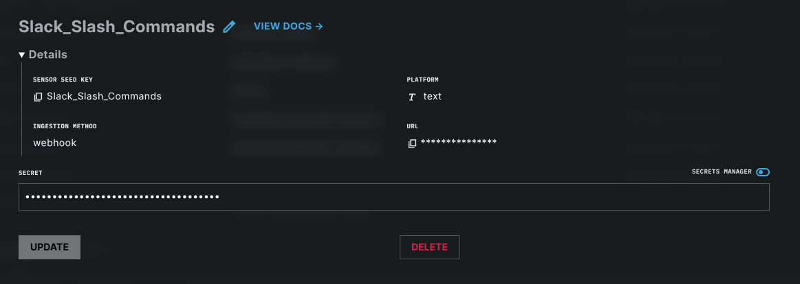

#### Option 1: Sensor IaC Template
Use this template in the IaC menu to create a new webhook sensor that will be used for receiving the output of the Slack slash command. Change the `oid`, `installation_key`, and `secret` fields to their respective values from your organization.  

> [!IMPORTANT]  
> Ensure you set the `oid`, `installation_key`, and `secret` fields, or your sensor will not work.  
> The `secret` field is the Webhook secret that will be included in your webhook URL. A random GUID generator such as [this one](https://www.guidgenerator.com/) works well for this task.

This template will create a new sensor called "Slack_Slash_Commands" and will be preconfigured to parse the Slack slash command output. 

```yaml
version: 3
hives:
    cloud_sensor:
        Slack_Slash_Commands:
            data:
                sensor_type: webhook            
                webhook:
                    secret: YOUR_SECRET_HERE                
                    client_options:
                        buffer_options: {}
                        hostname: Slack_Slash_Commands
                        identity:
                            installation_key: YOUR_INSTALL_KEY_HERE
                            oid: YOUR_OID_HERE
                        mappings:
                          - event_type_path: '{{"Slack Slash Command"}}'
                            parsing_re: '([\w\-]+)=([^\\\"]+)(?:\\u0026)?'
                            transform: 
                                # setting these just to keep things clean
                                +dvc_product: '{{ "Slash Command" }}'
                                +dvc_vendor: '{{ "Slack" }}'

                                #rename these to avoid confusion from the k:v pair key names
                                +src_user_name: '{{ .user_name }}'
                                +src_user_id: '{{ .user_id }}'
                                +src_channel_name: '{{ .channel_name }}'
                                -user_name: nil
                                -user_id: nil
                                -channel_name: nil

                                # decode the url encoding
                                +command: '{{ replace "%2F" "" $.command}}'
                                +response_url: '{{ replace "%2F" "/" $.response_url | replace "%3A" ":"}}'

                                # split out the command args into their own keys
                                +parsed_text: '{{ replace "%2F" "/" $.text | replace "%3A" ":" | replace "%40" "@" }}'
                                +org_name: '{{ $org := replace "%2F" "/" $.text | replace "%3A" ":" | replace "%40" "@" | split "+" }}{{ index $org 0 }}'
                                +users: '{{ $users := replace "%2F" "/" $.text | replace "%3A" ":" | replace "%40" "@" | split "+" }}{{ index $users 1 }}'
                                +channel_privacy: '{{ $channel_privacy := replace "%2F" "/" $.text | replace "%3A" ":" | replace "%40" "@" | split "+" }}{{ index $channel_privacy 2 }}'
                                +region: '{{ $region := replace "%2F" "/" $.text | replace "%3A" ":" | replace "%40" "@" | split "+" }}{{ index $region 3 }}'
                                +template: '{{ $template := replace "%2F" "/" $.text | replace "%3A" ":" | replace "%40" "@" | split "+" }}{{ index $template 4 }}'
                        platform: text
                        proxy: {}
                        sensor_seed_key: Slack_Slash_Commands

            usr_mtd:
                enabled: true
                expiry: 0
                tags: []
                comment: ""
```

#### Option 2: Manual Configuration

> [!CAUTION] 
> This method is more advanced and requires editing the organization's IaC.  
> **Only proceed if you are familiar with and comfortable editing the IaC for the org.**

Create a new sensor with the following settings:
* Type: Text/Syslog
* Installation Key: Your choice
* Ingestion Method: Events received through LimaCharlie webhooks
* Adapter Name: Your choice
* Secret: Your choice
> [!TIP]
> Do not use spaces for the Adapter Name or Secret, otherwise Slack will complain

Once created, edit your organization's IaC and find the new sensor you created. Remove the `mapping: {}` line from the sensor and add the following lines in place of the `mapping: {}` line. Ensure your indentation is correct, otherwise you'll run into issues. 

##### IaC to apply to the sensor
```yaml
                        mappings:
                          - event_type_path: '{{"Slack Slash Command"}}'
                            parsing_re: '([\w\-]+)=([^\\\"]+)(?:\\u0026)?'
                            transform: 
                                # setting these just to keep things clean
                                +dvc_product: '{{ "Slash Command" }}'
                                +dvc_vendor: '{{ "Slack" }}'

                                #rename these to avoid confusion from the k:v pair key names
                                +src_user_name: '{{ .user_name }}'
                                +src_user_id: '{{ .user_id }}'
                                +src_channel_name: '{{ .channel_name }}'
                                -user_name: nil
                                -user_id: nil
                                -channel_name: nil
                                    #          -token: nil # uncomment this to remove the token; unsure of security implications

                                # decode the url encoding
                                +command: '{{ replace "%2F" "" $.command}}'
                                +response_url: '{{ replace "%2F" "/" $.response_url | replace "%3A" ":"}}'

                                # split out the command args into their own keys
                                +parsed_text: '{{ replace "%2F" "/" $.text | replace "%3A" ":" | replace "%40" "@" }}'
                                +org_name: '{{ $org := replace "%2F" "/" $.text | replace "%3A" ":" | replace "%40" "@" | split "+" }}{{ index $org 0 }}'
                                +users: '{{ $users := replace "%2F" "/" $.text | replace "%3A" ":" | replace "%40" "@" | split "+" }}{{ index $users 1 }}'
                                +channel_privacy: '{{ $channel_privacy := replace "%2F" "/" $.text | replace "%3A" ":" | replace "%40" "@" | split "+" }}{{ index $channel_privacy 2 }}'
                                +region: '{{ $region := replace "%2F" "/" $.text | replace "%3A" ":" | replace "%40" "@" | split "+" }}{{ index $region 3 }}'
                                +template: '{{ $template := replace "%2F" "/" $.text | replace "%3A" ":" | replace "%40" "@" | split "+" }}{{ index $template 4 }}'
```
  
Your sensor IaC should look similar to the following images.  
**Before:**  
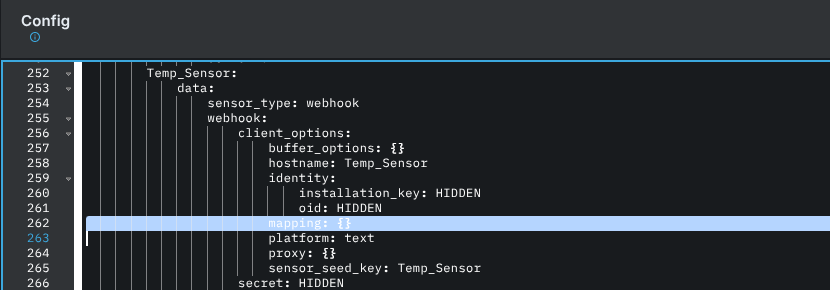  

**After:**  
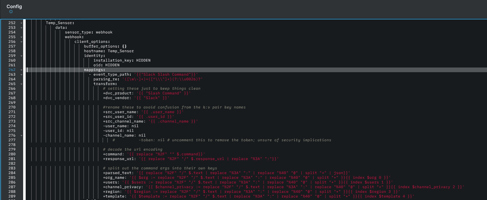 

## Slack App
### Purpose
The Slack app is required for creation of slash commands within slack and communications from LimaCharlie to Slack. This will be a custom app for your workspace and need to be approved by your workspace admin.  

### Required Scopes 
These may not all be required for the functionality provided by this use case, but this allows for additional functionality to be added later
```
channels:manage
channels:join
channels:read
channels:write.invites
chat:write
chat:write.public
commands
groups:write
groups:write.invites
groups:write.topic
im:write
mpim:write
users:read
users:read.email
```
### Configuration Steps

1. Within Slack, go to "Your Apps" and click "Create New App"  
   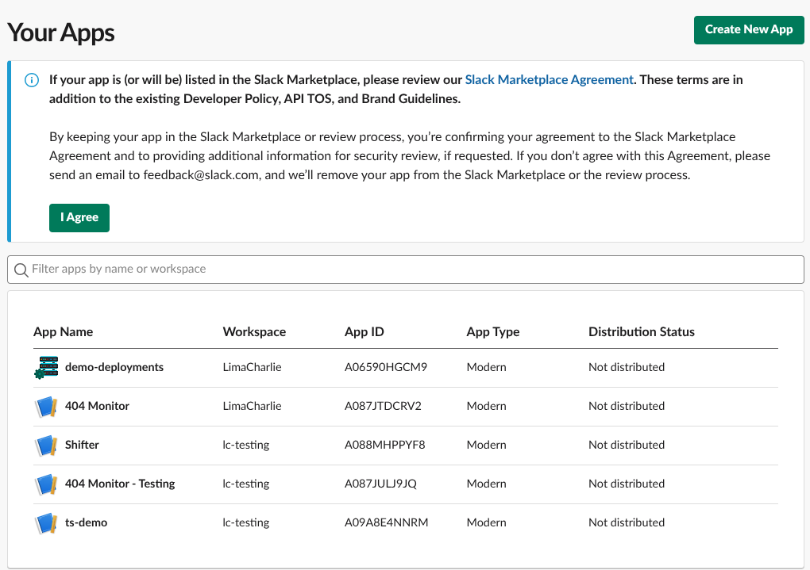  
2. Select "From Manifest"  
     
3. Select the workspace you want to place the app  
   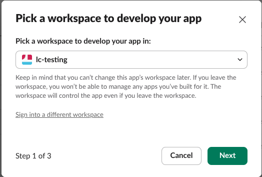  
4. Paste the [manifest from below](#app-manifest) into the box to overwrite the default manifest that is automatically created  
   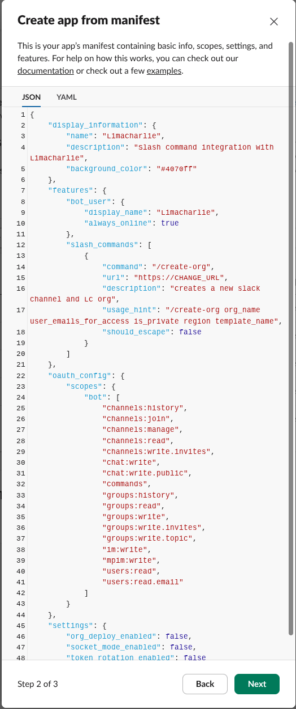  
5. Click "Create"  
   > [!TIP]
   > Alternatively, you can set the `url` field in the manifest to the webhook URL you created in [LimaCharlie Webhook Sensor](#limacharlie-webhook-sensor) prior to clicking "Create" and skip steps 6-8  

   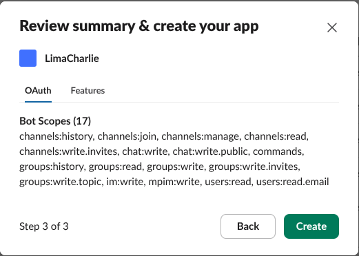  
6. Once your app is created, click on "Slash Commands"  
   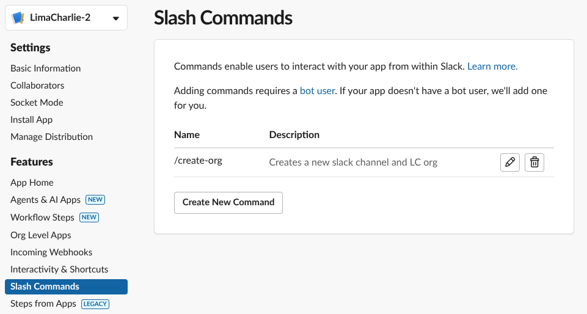  
7. Edit the "/create-org" command  
8. Paste the webhook URL you created in the [LimaCharlie Webhook Sensor](#limacharlie-webhook-sensor) in the "Request URL" field  
     
9.  Click "Save" to save the change  
10. Click on "OAuth & Permissions"  
    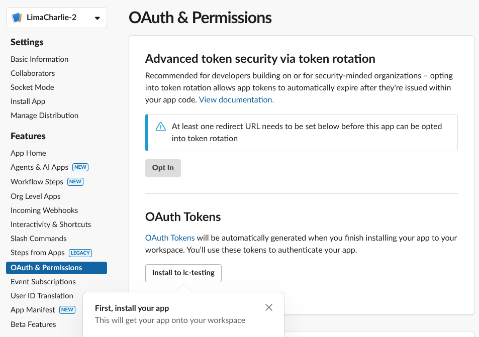  
11. A message will appear telling you that the app needs to be installed to the workspace. Click on the button to install the app to your workspace.  
12. Review the permissions being requested and click "Allow"  
    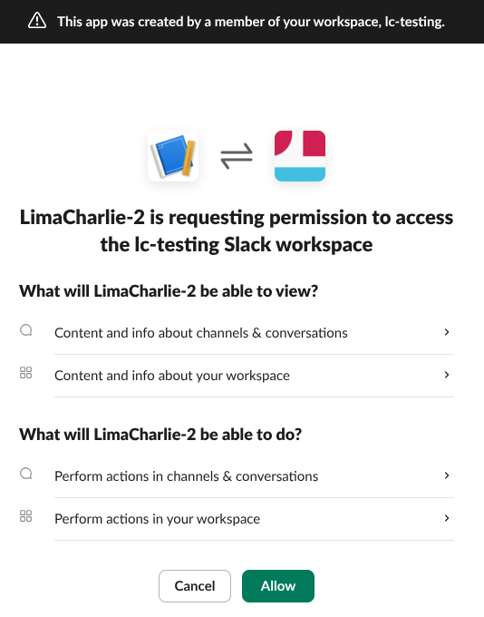  
13. An OAuth token will be created when the app is installed. Copy this token and somewhere you can access it. It will be used within the playbooks later  
    **Note: This token has already been revoked. Attempting to use it will only get Slack mad at you!**  
      


#### App Manifest
```json
{
    "display_information": {
        "name": "LimaCharlie",
        "description": "Slash command integration with LimaCharlie",
        "background_color": "#4070ff"
    },
    "features": {
        "bot_user": {
            "display_name": "LimaCharlie",
            "always_online": true
        },
        "slash_commands": [
            {
                "command": "/create-org",
                "url": "https://CHANGE_URL",
                "description": "Creates a new slack channel and LC org",
                "usage_hint": "/create-org ORG_NAME USER_EMAILS_FOR_ACCESS IS_PRIVATE REGION TEMPLATE_NAME",
                "should_escape": false
            }
        ]
    },
    "oauth_config": {
        "scopes": {
            "bot": [
                "channels:history",
                "channels:join",
                "channels:manage",
                "channels:read",
                "channels:write.invites",
                "chat:write",
                "chat:write.public",
                "commands",
                "groups:history",
                "groups:read",
                "groups:write",
                "groups:write.invites",
                "groups:write.topic",
                "im:write",
                "mpim:write",
                "users:read",
                "users:read.email"
            ]
        }
    },
    "settings": {
        "org_deploy_enabled": false,
        "socket_mode_enabled": false,
        "token_rotation_enabled": false
    }
}
```

### Testing
To test the connectivity between Slack and LimaCharlie, execute the slash command from your Slack workspace and view corresponding the LimaCharlie sensor's timeline. Verify the results of your slash command appear in the timeline and are parsed correctly. 

Example Slack slash command execution:  
 `/create-org testing-org chris.botelho@limacharlie.com true us dfir`  

Example result from LimaCharlie:  
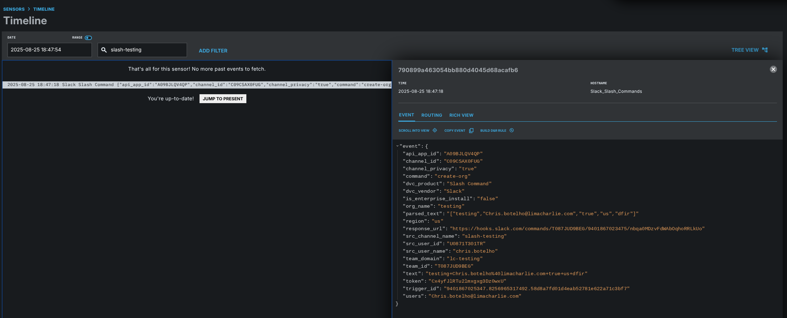  

### Notes 
See [Slack slash command documentation](https://api.slack.com/interactivity/slash-commands) for further information. 

## LimaCharlie Secrets  
Save each of the secrets below to their own individual entries in the the LimaCharlie Secrets Manager. Make a note of the names of each so they can be refrenced later.  

### LimaCharlie User API Key
**Purpose:** The API key used to instantiate the SDK object in the playbook cannot be used for org creation. Likewise, the key used for org and group creation cannot be used for instantiating the SDK. For this reason, a special API key will need to be created and stored as a secret within LimaCharlie for the playbook to access. 
**Playbook Field Name:** `lc_user_secret`
**Creation:**  
1. Log in to the the LimaCharlie console  
2. At the top-right of the screen, click "Settings" and then "Manage User Settings"  
   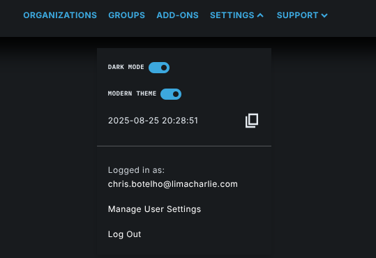  
3. Click on "User API Keys"  
   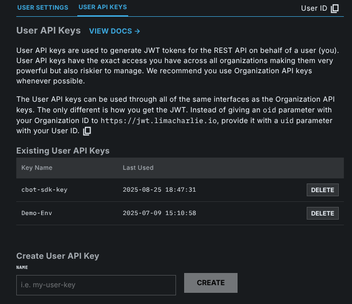  
4. Enter a name for the API key, such as `LC_Playbook` and then click "Create"  
   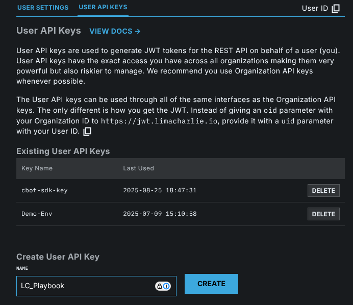  
5. Click the "Copy" icon and paste the API key somewhere you can reference it  
     
6. Copy your User ID by clicking the "Copy" icon and paste it somewhere you can reference it  
     
7. Go to your organization  
8. On the left menu, click on "Organization Settings" and then select "Secrets Manager"  
   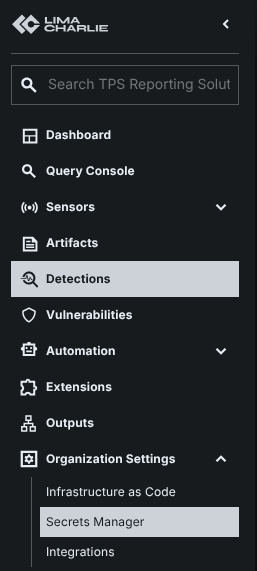  
9.  Click "Add Secret"  
   
10. Give your secret a name you can reference later  
11. Copy your UserID and paste it in the "Secret" field  
12. Add a slash after your UserID  
13. Paste the API key you copied in step 5 in the "Secret" box. The secret should now have the format of `UserID/API Key`  
    > [!TIP]
    > Your secret should look similar to this: `JvNOyQocBNNfWRKIIPEP3YITV0m1/12a4a04e-365a-4fa5-bca7-1c97f0af2ac2` 
14. Click "Create" to save the secret to your organization  
**Example:** 
  

> [!CAUTION]
> This is a super powered key that has the ability to do bad things if revealed to bad actors. Keep it protected!  

### Slack API Key
**Purpose:** Used to interact with Slack, such as creating channels and posting messages.
**Playbook Field Name:** `slack_secret`
**Creation:** This is the API key provided by Slack when the app is installed to your workspace. 
**Example:**  


### SDK User API Key
**Purpose:** Instantiates the SDK object in the playbook  
**Note:** This will be passed to the playbook when the playbook is executed and gives access to the SDK object used in the playbook  
**Creation:**  
1. Go to your organization  
2. Click on "Access Management" and then select "REST API"  
3. Click "Create API Key"  
4. Click "Select All" for the permissions  
5. Give the key a name and then click "Create"  
6. Copy the API key to somewhere you can reference it  
   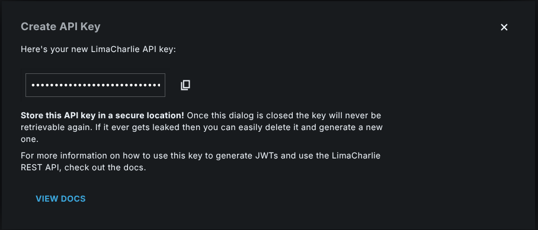  
7. Click on "Organization Settings" and then select "Secrets Manager"  
8. Click "Add Secret"  
9. Give your secret a name you can reference later  
10. Paste the API key you created in step 6 in the "Secret" box  
11. Click "Create" to save the secret to your organization  
**Example:**  
  

### Permissions List
**Purpose:** Stores the list of permissions to apply to the new LimaCharlie group created during organization deployment  
**Playbook Field Name:** `perm_template`  
**Creation:**  
1. Review the LimaCharlie permissions available and create a comma-separated list of the permissions to apply to auto-generated groups.  
   Available permissions are documented here: [Reference: Permissions](https://docs.limacharlie.io/docs/reference-permissions)  
2. Copy the list you created to the clipboard  
3. Go to your organization  
4. Click on "Organization Settings" and then select "Secrets Manager"  
5. Click "Add Secret"  
6. Give your secret a name you can reference later  
7. Paste the CSV you copied in step 1 in the "Secret" box  
8. Click "Create" to save the secret to your organization  
**Example:**  
  

## LimaCharlie D&R Rules  
The Detection and Response rules are first triggered when a matching Slack slash command is detected. The responding action executes the first playbook to create the corresponding Slack channel and invite the designated users to the channel. When completed, the next rule is triggered. This rule is responsible for creating the organization with or without an IaC template, user group, and applying permissions to the user group.

### Configuration Steps
1. Copy and paste the [following code](#dr-rule-iac) into the "Infrastructure as Code" page within the "Organization Settings" option for your organization.
2. Click "Apply Additive Changes"  
   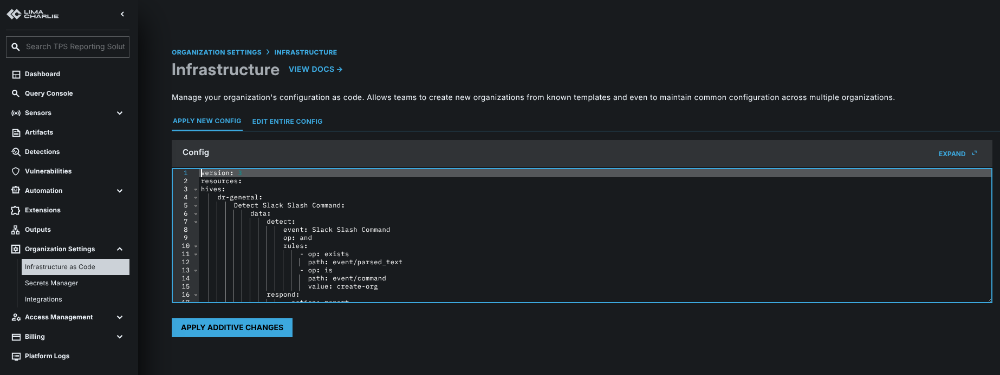  
3. Verify there aren't any errors showing on the confirmation screen and the changes match what is expected, then click "Apply Changes"
   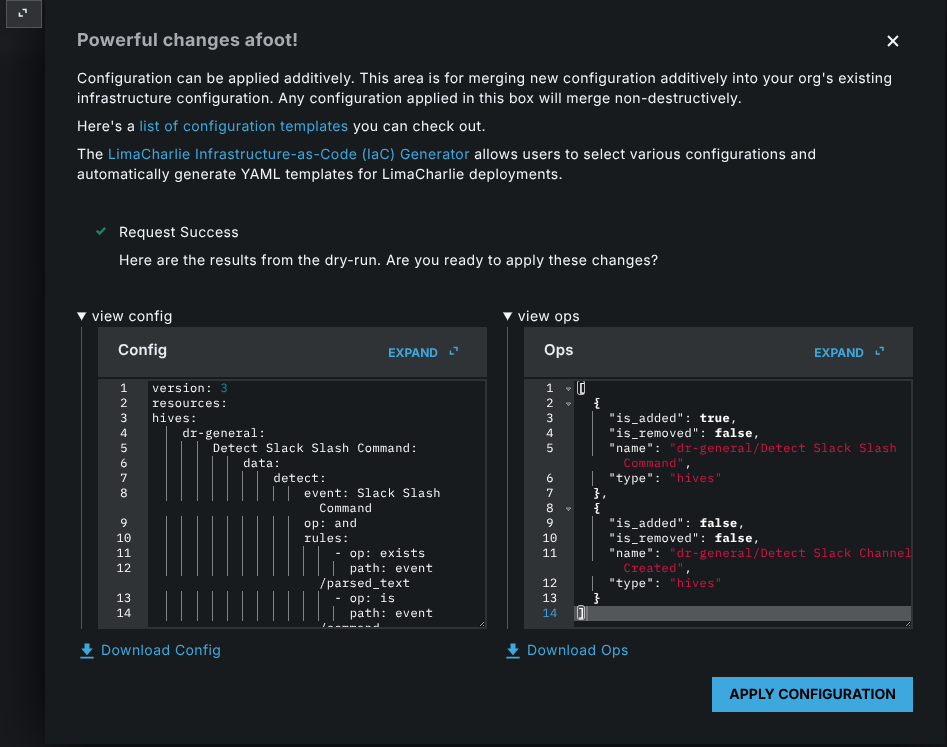
4. If successful, a notification should briefly pop up in the bottom right of your screen
5. On the left menu, go to "Automation" and then select "D&R Rules"
6. Verify the following rules are showing and enabled. If they don't show up, refresh the page  
   `Detect Slack Channel Created`  
   `Detect Slack Slash Command`  
     

#### D&R Rule IaC

> [!IMPORTANT]
> Ensure you change any field that says "CHANGE_ME" to their respective values. These will be the secrets you created in the [LimaCharlie Secrets](#limacharlie-secrets) section. 

```yaml
version: 3
resources:
hives:
    dr-general:
        Detect Slack Slash Command:
            data:
                detect:
                    event: Slack Slash Command
                    op: and
                    rules:
                      - op: is
                        path: event/dvc_vendor
                        value: Slack
                      - op: is
                        path: event/dvc_product
                        value: Slash Command
                      - op: is
                        path: event/command
                        value: create-org
                respond:
                    - action: report
                      name: 'Creating Slack channel: #{{ .event.org_name }} requested by {{ .event.src_user_name }}'
                    - action: extension request
                      extension action: run_playbook
                      extension name: ext-playbook
                      extension request:
                        credentials: '{{ "hive://secret/CHANGE_ME" }}'
                        data:
                            channel_name: '{{ .event.org_name }}'
                            is_private: '{{ .event.channel_privacy }}'
                            response_url: '{{ .event.response_url }}'
                            slack_secret: '{{ "CHANGE_ME" }}'
                            src_user_id: '{{ .event.src_user_id }}'
                            users: '{{ .event.users }}'
                            command_args: '{{ .event.parsed_text }}'
                        name: '{{ "Create Slack Channel" }}'
            usr_mtd:
                enabled: true

        Detect Slack Channel Created:
            data:
                detect:
                    event: run_success
                    op: and
                    rules:
                        - op: is
                          path: routing/hostname
                          value: ext-playbook
                        - op: is
                          path: event/data/slack_event
                          value: slack_channel_created
                respond:
                    - action: report
                      name: 'Slack channel created: #{{ .event.data.channel.name }}. Generating LC org'
                    - action: extension request
                      extension action: run_playbook
                      extension name: ext-playbook
                      extension request:
                        credentials: '{{ "hive://secret/CHANGE_ME" }}'
                        data:
                            iac_url: '{{.event.template }}'
                            org_location: '{{ .event.region }}'
                            org_name: '{{ .event.data.channel.name }}'
                            perm_template: '{{"my-group-template"}}'
                            requestor: '{{UPDATE_ME!!!!}}'
                            lc_user_secret: '{{"CHANGE_ME"}}'
                            slack_channel: '{{ .event.data.channel.id }}'
                            slack_secret: '{{"CHANGE_ME"}}'
                            users:  '{{ .event.data.slack_data.users }}
                        name: '{{ "Create LC Org" }}'
            usr_mtd:
                enabled: true
```

## LimaCharlie Playbooks  
This can either be done by utilizing the [IaC template](#option-1-sensor-iac-template) below to create and configure the playbooks at the same time, or [manual configuration](#option-2-manual-configuration) by creating the playbooks via the UI. If doing the manual configuration, you'll need to ensure the playbooks are named correctly OR update the D&R rules to the correct playbook names. The playbook name to execute is defined in the `extension request/name` field within the response action.

### Purpose
The two playbooks are responsible for interacting with Slack and LimaCharlie. Both playbooks are able to be executed independently, but they both require specific fields to be populated in the `data` field as part of the `extension request` action. 

#### Slack Channel Creation Playbook  
**Playbook Name:** `Create Slack Channel`  
**Required `data` Parameters:**  
| Parameter | Required? | Description |
| --------- | --------- | ----------- | 
| `channel_name` | True | Name of the channel to create |
| `is_private` | True | Whether the channel should be set as private<br />`true` means the channel will be private<br />`false` means the channel will be public |
| `response_url` | True | Ephemeral URL created by Slack and passed as part of the HTTP POST of where to send a response to the Slack slash command |
| `src_user_id` | True | ID of the user who requested the channel creation passed as part of HTTP POST message from Slack |
| `users` | True | A list of valid Slack users to invite to the newly created channel |
| `slack_secret` | True | Name of the secret created in the [Slack API Key](#slack-api-key) step |
| `command_args` | False | Parsed list of arguments sent to the Slash command<br />Useful for passing to additional D&R rules and playbooks |

> [!TIP]
> Most of these fields will come from the Slack slash command  
> For more details on the fields coming from the command, see the [Event Details Fields](#event-details-fields) section  

##### Example Execution and Returned Data  
**Example Response Action:**  
This is an example of a response action used to execute the Slack Channel Creation Playbook  
```yaml
                respond:
                    - action: extension request
                      extension action: run_playbook
                      extension name: ext-playbook
                      extension request:
                        credentials: '{{ "hive://secret/lc_sdk_key" }}'
                        data:
                            channel_name: '{{ .event.org_name }}'
                            is_private: '{{ .event.channel_privacy }}'
                            response_url: '{{ .event.response_url }}'
                            slack_secret: '{{ my_slack_api_secret }}'
                            src_user_id: '{{ .event.src_user_id }}'
                            users: '{{ .event.users }}'
                            command_args: '{{ .event.parsed_text }}'
                        name: '{{ "Create Slack Channel" }}'
```  

**Example Returned Data:**  
These are the contents of the `data` object returned from the playbook execution. Many of these fields are utilized in the [Create LimaCharlie Organization Playbook](#create-limacharlie-organization-playbook). These events can be viewed from the `ext-playbook` sensor's timeline. The `slack_data` and `slack_event` fields are added by the playbook for use within LimaCharlie D&R rules and further playbook executions.  

```json
{
  "data": {
    "channel": {
      "context_team_id": "T087JUD9BEG",
      "created": 1756147646,
      "creator": "U09AW4ZT31Q",
      "id": "C09BKCRCHP1",
      "is_archived": false,
      "is_channel": true,
      "is_ext_shared": false,
      "is_general": false,
      "is_group": false,
      "is_im": false,
      "is_member": true,
      "is_mpim": false,
      "is_open": true,
      "is_org_shared": false,
      "is_pending_ext_shared": false,
      "is_private": true,
      "is_shared": false,
      "last_read": "0000000000.000000",
      "name": "testing",
      "name_normalized": "testing",
      "parent_conversation": null,
      "pending_connected_team_ids": [],
      "pending_shared": [],
      "purpose": {
        "creator": "",
        "last_set": 0,
        "value": ""
      },
      "shared_team_ids": [
        "T087JUD9BEG"
      ],
      "topic": {
        "creator": "",
        "last_set": 0,
        "value": ""
      },
      "unlinked": 0,
      "updated": 1756147646973
    },
    "ok": true,
    "slack_data": {
      "channel_name": "testing",
      "is_private": "true",
      "response_url": "https://hooks.slack.com/commands/T087JUD9BEG/9401867023475/nbqa0MDzvFdWAbOqhoRRLkUo",
      "slack_secret": "slack-api",
      "src_user_name": "chris.botelho",
      "users": "Chris.botelho@limacharlie.com"
    },
    "slack_event": "slack_channel_created",
    "slack_response": "ok"
  },
  "duration": 1.9823877811431885,
  "event": "run_success"
}
```  

#### Create LimaCharlie Organization Playbook  
**Playbook Name:** `Create LC Org`  
**Required `data` Parameters:**  
| Parameter | Description |
| --------- | ----------- |
| `iac_url`   | Payload name or public URL of the IaC template to apply to the organization when created |
| `org_location` | Name of location to create the organization in.  <br />Select one of: <br />`us` for USA<br />`ca` for Canada<br />`in` for India<br />`uk` for UK<br />`eu` for Europe<br />`au` for Australia |
| `org_name` | Name of the organization and permissions group to create |
| `group_perm_secret` | Name of the secret with the permissions template to apply to the created group | 
| `requestor` | Person requesting the organization creation<br />**The group created by this playbook will have the owner set to this user, so the user must be a valid LimaCharlie account** |
| `users` | A list of valid LimaCharlie users who will have access to the organization |
| `slack_channel` | Slack channel id (not channel name) to output the status messages to |
| `slack_secret` | Name of the secret created in the [Slack API Key](#slack-api-key) step |
| `lc_user_secret` | Name of the secret created in the [LimaCharlie User API Key](#limacharlie-user-api-key) step |  

##### Example Execution and Returned Data  
**Example Response Action:**  
```yaml
                respond:
                    - action: extension request
                      extension action: run_playbook
                      extension name: ext-playbook
                      extension request:
                        credentials: '{{ "hive://secret/my_sdk_secret" }}'
                        data:
                            iac_url: '{{.event.}}'
                            org_location: '{{"LCIO-NYC3-USAGE-V1"}}'
                            org_name: '{{ .event.data.channel.name }}'
                            group_perm_secret: '{{"my-group-secret"}}'
                            requestor: '{{UPDATE_ME!!!!}}'
                            lc_user_secret: '{{"CHANGE_ME"}}'
                            slack_channel: '{{ .event.data.channel.id }}'
                            slack_secret: '{{"CHANGE_ME"}}'
                            users:  '
                        name: '{{ "Create LC Org" }}'
```

### Configuration Steps
Utilize either the [IaC template](#option-1-playbook-iac-template) below for the fastest and easiest method of deploying the required sensor or the [manual configuration](#option-2-manual-playbook-creation) to customize the settings for your environment. 

#### Option 1: Playbook IaC Template
Use this template in the IaC menu to create the playbooks utilized in the D&R rules [previously created](#limacharlie-dr-rules). This option will be typically be easiest to ensure compatibility with the previously created content. 


#### Option 2: Manual Playbook Creation

